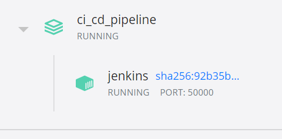
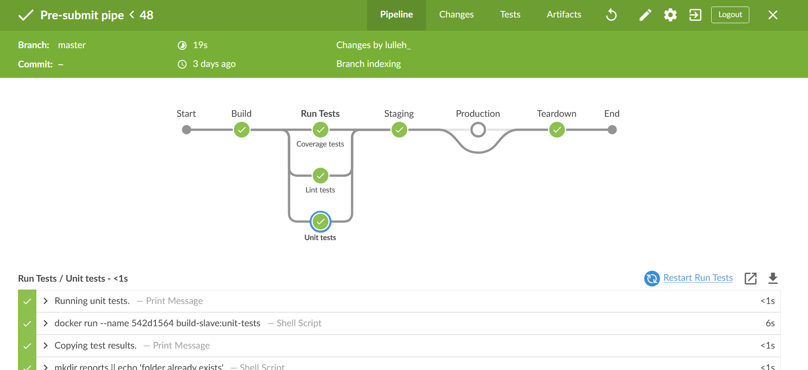
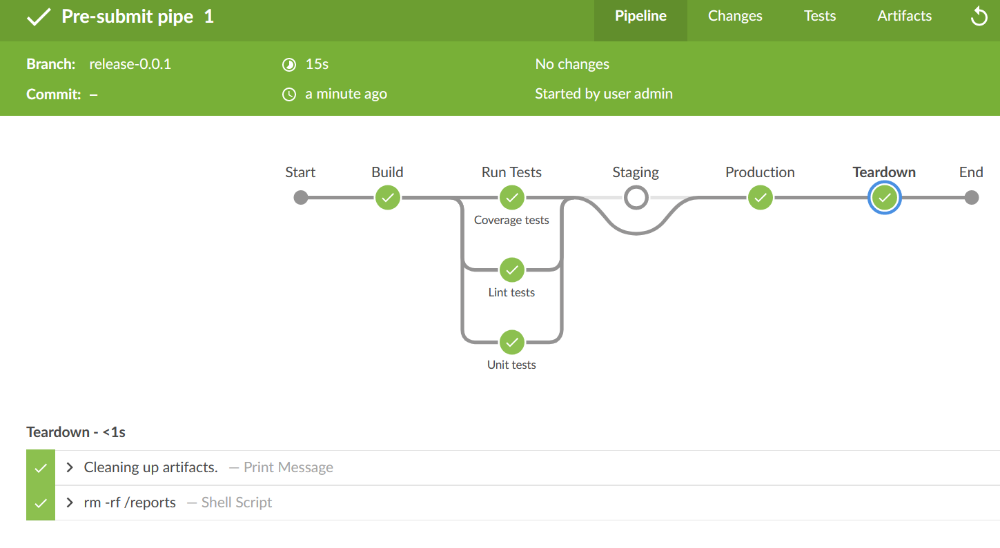
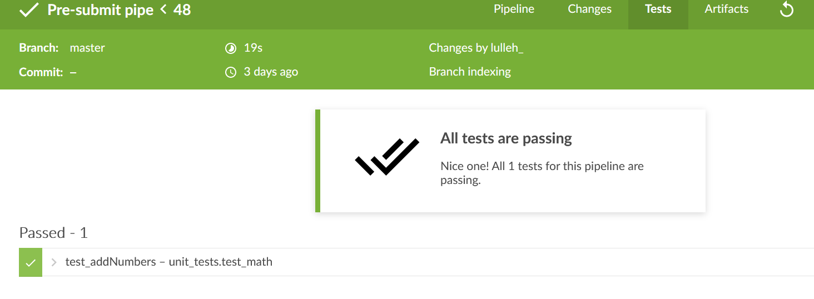

# CI/CD pipeline with Jenkins CASC

This project provides a container prebuilt with a configuration for Jenkins. It avoids the hassles of manually configuring and downloading plugins for Jenkins. It also uses a docker sidecar configuration, meaning docker CLI is included in the container and connects to the docker socket on the host. This enables the pipeline to perform Docker commands exposed by the docker API without the need for special extensions or plugins.

A docker sidecar configuration is useful in todays EAC (everything-as-code) environment where a lot of applications are packaged, distributed and deployed as images and containers.

This project could serve as a template setup for your own pipeline.

> All you need is docker.

## Example
This example (specified in the Jenkinsfile) will build a unit test image from the Dockerfile.test file and use it to spin up a testrunner. The testrunner will install all necessary dependencies, run the tests and save the results. The jenkins master will then copy the results from the container, remove the container and display the test results.

Jenkins running in docker.  
  
A commit triggers the pipeline.  
  
The production stage is only triggered by a tagged release.  
  
Full unit test integration with blue oceans ui.  
  

## Environment

This project assumes the host is running docker on WSL2/Debian/Ubuntu. For a windows setup the docker daemon must be exposed for tcp://localhost:2375

Create a file `.env` with the following:
```
JENKINS_ADMIN_ID="your_admin_id"
JENKINS_ADMIN_PASSWORD="your_password"
JENKINS_HOST_URL="your_url"
```

Make sure rw permissions are set for the docker.sock on the **host**. > chmod 666 /var/run/docker.sock

## Run

`docker-compose build && docker-compose up -d`
